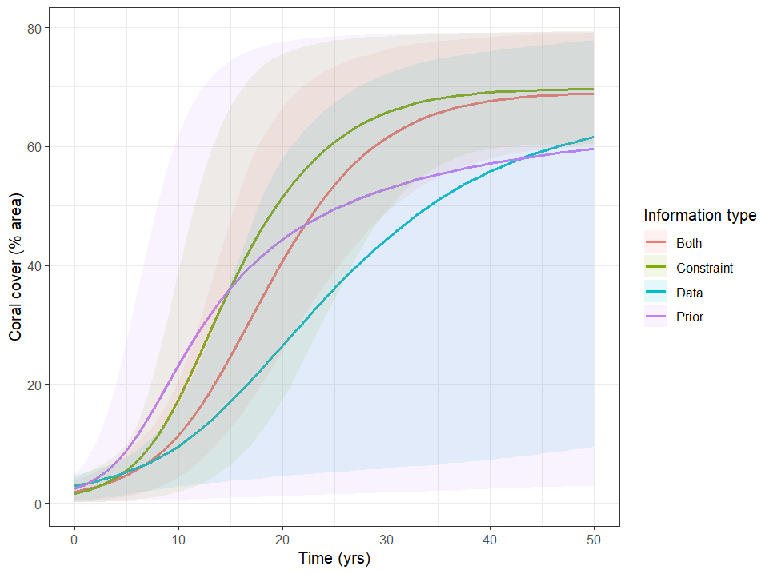

[](https://doi.org/10.5281/zenodo.21814852)
# Table of Contents
- [Introduction](#introduction)
- [Installation](#installation)
- [Getting started with a simple example](#getting-started-with-a-simple-example)
  - [Mathematical formalism](#mathematical-formalism)
    - [Logistic growth model](#logistic-growth-model)
    - [Non-empirical constraints](#non-empirical-constraints)
    - [Combining data with non-empirical constraints](#combining-data-with-non-empirical-constraints)
  - [Coding the logistic growth rate example into R](#coding-the-logistic-growth-rate-example-into-R)
    - [Overview of the main function SMCfeatures](#overview-of-the-main-function-SMCfeatures)
    - [Step 1 defining the model function](#step-1-defining-the-model-function)
    - [Step 2 defining the discrepancy function](#step-2-defining-the-discrepancy-function)
    - [Generating samples](#generating-samples)

# Introduction

This R package is an implementation of the methods as described in "Beyond data: leveraging non-empirical information and expert knowledge in Bayesian model calibration" (2025) by Vollert, Drovandi, Jeynes-Smith, Pascal and Adams. This package contains code to calibrate any model to non-empirical information and data via a sequential Monte Carlo (SMC) algorithm that uses techniques from both approximate Bayesian computation and exact Bayesian inference. Here, we detail how to use this code for any model and information, via an example in logistic coral growth. 


# Installation

```r
packages_to_install <- c("parallel", "doParallel", "foreach","dplyr", "foreach", "ggplot2", "magrittr", "MASS", "parallel", "parallelly","stats","tidyr")

# Install packages if not already installed
install_if_not_installed <- function(package) {
  if (!requireNamespace(package, quietly = TRUE)) {
    install.packages(package, dependencies = TRUE)
  }
}

# Apply the function to install packages
invisible(lapply(packages_to_install, install_if_not_installed))

#Install from github
library(devtools)
install_github("luzvpascal/SMCfeatures",
               host = "https://api.github.com")
```

# Getting started with a simple example

## Mathematical formalism

### Logistic growth model
We consider a simple logistic growth example, representing the recovery of coral populations after a disturbance. The logistic growth model can be expressed as:

```math
\frac{\rm{d}y}{\rm{d}t} = r.y(t)\left(1-\frac{y(t)}{K}\right),\quad y(0) = y_0,
```
where $y (t)$ represents the coral cover at year $t$ (% area), $t$ is the time (years), $r$ is the growth rate ($year^{-1}$), $K$ is the carrying capacity (% area) and $y_0$ is the initial coral cover (% area).

The analytical solution of this ODE is :
```math
y(t) = \frac{Ky_0}{y_0+(K-y_0)e^{-rt}}.
```

Three parameters are uncertain: $r$, $K$ and $y_0$.

### Non-empirical constraints

We assume that experts have some non-empirical constraints, for example derived from expert knowledge. After a disturbance:
- "coral cover should be less than 10% within the first 5 years"
- "coral cover should be fully recovered within 1% of the carrying capacity within 50 years"

These constraints can be expressed mathematically as:
```math
y(5)=\frac{Ky_0}{y_0+(K-y_0)e^{-5r}} \leq 10, \quad \quad y(50)=\frac{Ky_0}{y_0+(K-y_0)e^{-50r}} \geq K-1.
```

To include this non-empirical information into model calibration, we define a discrepancy function $\rho$ that describes the discrepancy from expected behaviours:
```math
\rho = \rho_5 + \rho_{50}
```
where
```math
\rho_5 = \max(0, y(5) - 10) \quad \text{and} \quad \rho_{50}=\max(0, K - 1 - y(50)).
```

$\rho_5$ measures the discrepancy between modeled coral cover and recovering beyond 10% at year 5, and $\rho_{50}$ the gap between modeled coral cover and recovering less than $K-1$% at year 50.

This discrepancy function will be used to calibrate the model to non-empirical information. 


### Combining data with non-empirical constraints

In addition, we will calibrate the model to a dataset. Here, we use a Gaussian likelihood function.
We assume that we have a dataset $\mathcal{D}(I, O)$, where $I$ are the data inputs and $O$ the data outputs. The Gaussian log-likelihood function is thus:

```math
\mathcal{L}(I, O) = - |D|\log(\sigma) - \sum_i \frac{(O_i - y(I_i))^2}{2\sigma^2},
```
where $y(I_i)$ is the output of the model evaluated on the input data $I_i$. For the logistic growth model, $y$ is defined by parameters $r$, $K$ and $y_0$. Here, we are calibrating an additional parameter, $\sigma$, which is the measurement noise. 


## Coding the logistic growth rate example into R

### Overview of the main function SMCfeatures
By specifying a model, a discrepancy, and a dataset, the package can be simply used as follows. 

```r
library(SMCfeatures)
upper <- c(0.5, 80, 5, 20) #upper bound on r K y0 sigma
lower <- c(0, 60, 0, 0) #lower bound on r K y0 sigma
simulate_model <- SMCfeatures::model_logistic_growth #define the model as the logistic growth model
calculate_discrepancy <- SMCfeatures::discrepancy_logistic_growth #define the function that calculate the logistic growth
outputs <- SMCfeatures(
            upper=upper,
            lower=lower,
            simulate_model=simulate_model,
            calculate_discrepancy=calculate_discrepancy
            )
```

### Step 1 defining the model function

The first step of our approach is to define a function that simulates the model for any value of the model parameters (in this case $r$, $K$ and $y_0$). For the logistic growth example, this function is already implemented in the package, as `model_logistic_growth`.
```r
#' @title Model of logistic growth case study
#' @description
#' Simulate outputs of logistic growth model
#' @param parameters vector of parameters (growth rate, capacity, initial abundance)
#' @param input input data. here it is a vector of time steps of interest
#' @return
#' y_data: output of simulation on input data as a vector
#' @export
model_logistic_growth <- function(parameters,
                                  input){
  # likelihood needs data at all time points
  #Inputs parameters and outputs a simulation

  # Extract information
  r <- parameters[1]
  K <- parameters[2]
  y0 <- parameters[3]

  # Simulation details
  y_data <- (K*y0)/(y0+(K-y0)*exp(-input*r))
  return(y_data)
}
```
This function inputs a set of parameters (here $r$, $K$ and $y_0$) and a vector of data inputs (here a vector of times at which there is a data point). The output of this function is the specified output of the model as a vector (in this case, the modeled coral cover at the times when there is a data point).

### Step 2 defining the discrepancy function

The second step of our approach is to define a function that calculates the discrepancy for any parameters $r$, $K$ and $y_0$. For the logistic growth example, this function is already implemented in the package, as `discrepancy_logistic_growth`.
This function inputs a vector of parameters (r, K, y0 and sigma) for the logistic growth example. Then it calculates the discrepancy measure for the constraints at time 5 and 50 (see [Non-empirical constraints](#non-empirical-constraints)). The function must return a list with a simulation list like object with t_const, y_const, K.
and a summary statistic (discrepancy measure).

```r
#' @title Simulate constraints and calculate discrepancy function
#' @description
#' Simulate constraints and calculate discrepancy function. In this example, there are two non-empirical constraints: at year 5, the coral cover must be lower that 10%, and at year 50, the coral cover must be higher that K-1%.
#' @param parameters a vector of parameters. Here parameters must be input in this order r, K, y0 and sigma
#' @param args a list of arguments as defined in the function \link[SMCfeatures]{SMCfeatures}
#' @return a list with
#' simulation list like object with t_const, y_const, K.
#' a summary statistic (discrepancy measure).
#' @export
#'
discrepancy_logistic_growth <- function(parameters,
                                        args){

  simulation <- list()
  # Simulation details
  simulation$t_const <- c(5, 50)
  simulation$y_const <- SMCfeatures::model_logistic_growth(parameters,
                                                           simulation$t_const)
  simulation$K <- parameters[2]
  if (args$include_expert_constraints){

    ## 5yr constraint
    # max coral population in first 5 years
    max_population_in_5 <- simulation$y_const[1]

    # the max allowable coral population in first 5 years
    tolerance_in_5 <- 10

    #measure constraint discrepancy
    discrepancy_5 <- max(max_population_in_5 - tolerance_in_5,0)

    ## 50yr constraint
    # difference between carrying capacity and final coral population at 50 years
    difference_from_K <- simulation$K - simulation$y_const[2]

    # max allowable difference
    tolerance_in_50 <- 1 #within 1# of carrying cap

    #measure constraint discrepancy
    discrepancy_50 <- max(difference_from_K - tolerance_in_50,0)

    ## Discrepancy measure
    discrepancy <- discrepancy_5 + discrepancy_50

    return(list(simulation,discrepancy))
  } else {
    return(list(simulation,args$discrepancy_final))
  }
}
```
### Step 3 including observed data

Our package includes the option to additionally calibrate the model to observed data, as below.
```r
library(SMCfeatures)
upper <- c(0.5, 80, 5, 20) #upper bound on r K y0 sigma
lower <- c(0, 60, 0, 0) #lower bound on r K y0 sigma
simulate_model <- SMCfeatures::model_logistic_growth #define the model as the logistic growth model
calculate_discrepancy <- SMCfeatures::discrepancy_logistic_growth #define the function that calculate the logistic growth
input_data <- c(1,3,10) #input data years
output_data <- c(4, 4, 10) #output data coral cover
outputs <- SMCfeatures(
            upper=upper,
            lower=lower,
            simulate_model=simulate_model,
            calculate_discrepancy=calculate_discrepancy,
            input_data = input_data,
            output_data = output_data
            )
```

### Generating samples 

An example of this code, run in full, as in the paper "Beyond data: leveraging non-empirical information and expert knowledge in Bayesian model calibration" is shown below.


```r
#Install from github
library(devtools)
install_github("luzvpascal/SMCfeatures",
               host = "https://api.github.com")

library(SMCfeatures)
library(foreach)
library(tidyr)
library(tidyverse)
library(dplyr)

upper <- c(0.5, 80, 5, 20) #upper bound on r K y0 sigma
lower <- c(0, 60, 0, 0) #lower bound on r K y0 sigma
simulate_model <- SMCfeatures::model_logistic_growth #define the model as the logistic growth model
simulate_plots  <- SMCfeatures::model_for_plots_logistic_growth #define the model as the logistic growth model
calculate_discrepancy <- SMCfeatures::discrepancy_logistic_growth #define the function that calculate the logistic growth
input_data <- c(1,3,10) #input data years
output_data <- c(4, 4, 10) #output data coral cover
n_cores <- 4L

## outputs both: constraints and data ####
outputs_both <- SMCfeatures(
  upper=upper,
  lower=lower,
  simulate_model=simulate_model,
  simulate_plots=simulate_plots,
  calculate_discrepancy=calculate_discrepancy,
  input_data = input_data,
  output_data = output_data,
  n_cores=n_cores
)
## outputs constraints only ####
outputs_const <- SMCfeatures(
  upper=upper,
  lower=lower,
  simulate_model=simulate_model,
  simulate_plots=simulate_plots,
  calculate_discrepancy=calculate_discrepancy,
  n_cores=n_cores
)

## outputs data only ####
outputs_data <- SMCfeatures(
  upper=upper,
  lower=lower,
  include_expert_constraints =FALSE,#setting to false to use data only
  simulate_model=simulate_model,
  simulate_plots=simulate_plots,
  calculate_discrepancy=calculate_discrepancy,
  input_data = input_data,
  output_data = output_data,
  n_cores=n_cores
)

##Results both
y_both <-  unlist(lapply(outputs_both$param_sims_posterior, `[[`, 7))
t_both <-  unlist(lapply(outputs$param_sims_posterior, `[[`, 6))
data_both <- data.frame(y=y_both,t=t_both,type="Both")
##Results constraints
y_const <-  unlist(lapply(outputs_const$param_sims_posterior, `[[`, 7))
t_const <-  unlist(lapply(outputs$param_sims_posterior, `[[`, 6))
data_const <- data.frame(y=y_const,t=t_const,type="Constraint")
##Results only data
y_data <-  unlist(lapply(outputs_data$param_sims_posterior, `[[`, 7))
t_data <-  unlist(lapply(outputs$param_sims_posterior, `[[`, 6))
data_data <- data.frame(y=y_data,t=t_data,type="Data")

##Results prior
y_prior <-  unlist(lapply(outputs_both$param_sims_prior, `[[`, 7))
t_prior <-  unlist(lapply(outputs_both$param_sims_prior, `[[`, 6))
data_prior <- data.frame(y=y_prior,t=t_prior,type="Prior")

data_sum <- rbind(data_both,
                  data_const,
                  data_data,
                  data_prior) %>%
  group_by(t,type)%>%
  summarise(mean_cover=mean(y),
            upper=quantile(y,0.975),
            lower=quantile(y,0.025)
            )

## plot
data_sum %>%
  ggplot()+
  geom_line(aes(x=t,y=mean_cover, group=type,col=type), linewidth=1)+
  geom_ribbon(aes(x=t, ymin = lower,ymax=upper, group=type,fill=type), alpha=0.1)+
  theme_bw()+
  labs(x="Time (yrs)",
       y="Coral cover (% area)",
       fill="Information type",
       col="Information type")
```

